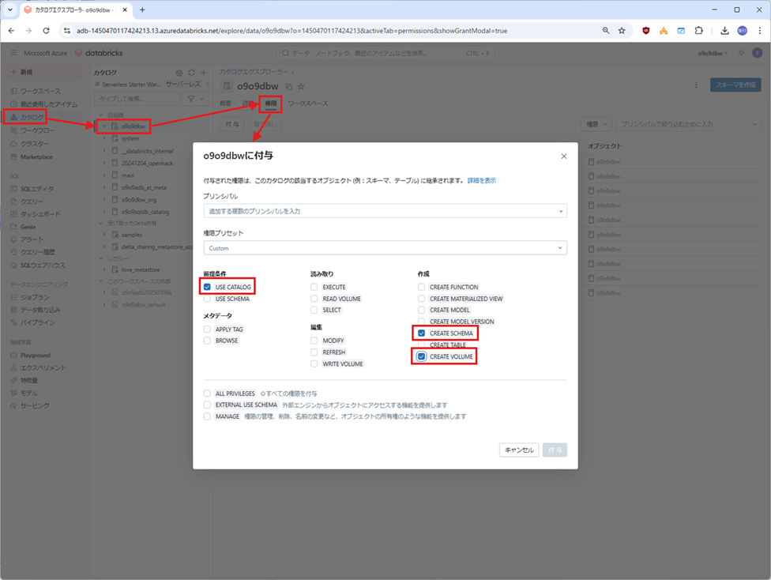
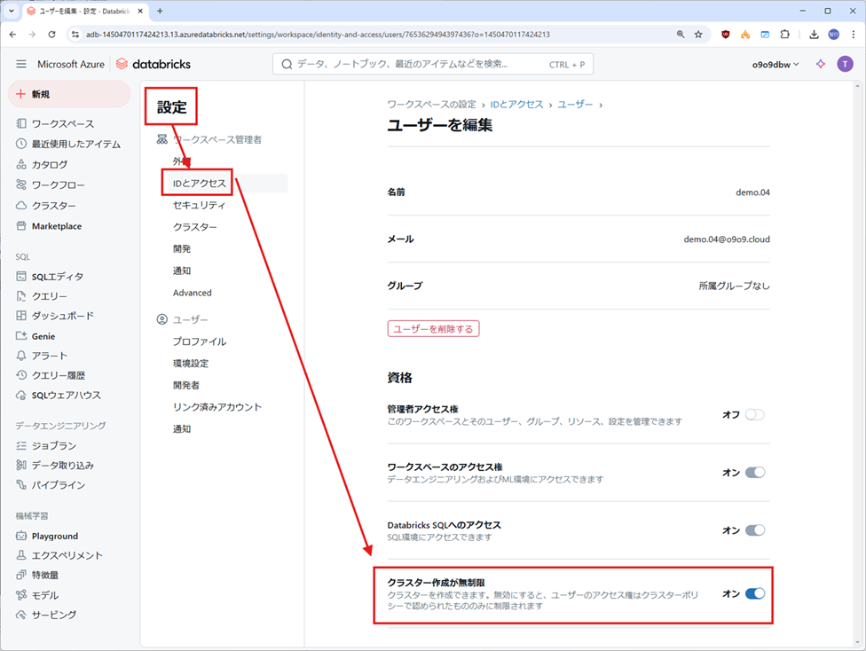

## 事前確認事項

#### 参加者権限設定
一般ユーザーでハンズオンを行う場合は一般ユーザー既定の権限に対して以下の権限を追加してください。
- USE CATALOG 
- CREATE SCHEMA
- CREATE VOLUME
- CREATE CLUSTER（ユーザー管理画面で`Unrestricted cluster creation`にチェック）
 
 

#### 必要ツール
- [Power BI Desktop](https://www.microsoft.com/ja-jp/power-platform/products/power-bi/desktop) を各自の PC にインストールしてください。最新版が望ましいです。
 
 